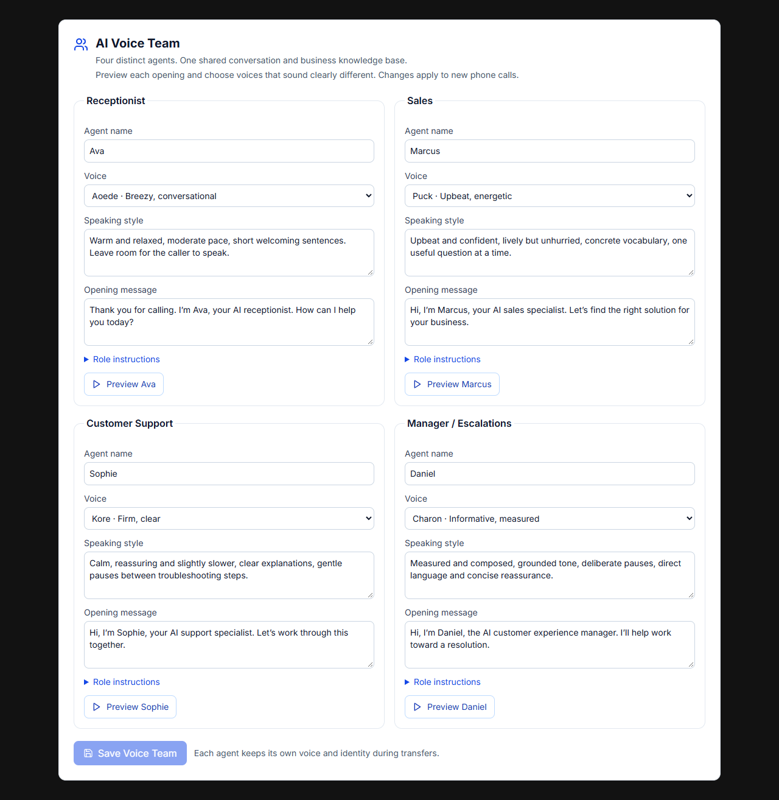

# AI Voice Team

BuildMyBot's production phone path uses Telnyx Call Control and Gemini 3.1 Flash Live. Receptionist, Sales, Support and Manager are independently configured agents. Every successful AI handoff opens a fresh Gemini WebSocket with the destination's voice, identity, role instructions and opening behavior. One Telnyx phone connection remains open.

## Default staff

| Role | Name | Gemini voice | Intended delivery |
| --- | --- | --- | --- |
| Receptionist | Ava | Aoede | Warm, relaxed, moderate pace |
| Sales | Marcus | Puck | Upbeat, confident, energetic |
| Customer Support | Sophie | Kore | Calm, clear, slightly slower |
| Manager / Escalations | Daniel | Charon | Measured, composed, deliberate |

These are configurable defaults. Audition the team on the actual phone path to assess perceptual separation; different IDs alone do not prove that every listener will distinguish the voices.

## Current code and the original fault

- `api/voice/telnyx-live.ts`: phone media, Gemini sessions, department handoffs, caller context and call logging.
- `shared/voice-team.ts`: four independent agent definitions, supported voices, strict validation and routing policy.
- `api/voice/team.ts`: authenticated settings and preview API.
- `api/voice/team-store.ts`: tenant-scoped persistence.
- `api/voice/team-preview.ts`: short previews using the same Gemini Live model and voice as calls.
- `components/PhoneAgent/VoiceTeamEditor.tsx`: reusable team editor.
- `components/PhoneAgent/PhoneAgent.tsx` and `components/Team/CorporatePhonePanel.tsx`: customer and corporate entry points.

Previously, `route_department` returned instructions to the existing model connection. Its initial setup selected Aoede by default, so the caller heard the same voice changing roles. The new implementation treats routing as a connection lifecycle change.

## Handoff lifecycle

1. Validate the destination, require a factual summary, reject self-transfers, and enforce a maximum of eight attempts per call.
2. Keep the source available while starting the destination. Buffer up to ten seconds of recent caller audio during setup.
3. When destination setup completes, clear queued source playback, retire the old session, and enable the destination. Late source events cannot speak, execute tools, or finalize the new session.
4. Give the destination the caller number, known name/company/reason, handoff summary and a bounded recent transcript. It introduces its own name and role, acknowledges the issue and avoids repeat questions.
5. If setup fails or exceeds ten seconds, return a failed tool result to the source and replay buffered caller audio. If neither connection is available, use the existing phone fallback.
6. On hangup or duration limit, close all agent sessions and timers. Preserve the original call duration limit across every handoff.

The call snapshot contains four agent definitions. Stable identity is `botId:department`; a successful transfer changes that identity and creates a new model session. Business instructions, knowledge access and confirmed tool results may be shared. Previous persona and voice settings are never used as the destination configuration.

`admin` is accepted as a compatibility alias for `manager`. Explicit human requests remain human-transfer or follow-up requests; the AI manager has no extra billing, account or contractual permissions. Corporate outbound approval is unchanged. Approved outbound calls begin with Sales and their approved objective.

## Persistence

The migration adds the backend-only `voice_teams` table. It retains the existing `voice_agents` row as the phone-number binding.

| Column | Purpose |
| --- | --- |
| bot_id | Primary key and foreign key to bots; one team per bot |
| user_id / organization_id | Owner and tenant copied from the verified bot |
| config | JSON object containing all four independently configured agents |
| revision | Positive integer used for optimistic concurrency |
| updated_by | Authenticated editor |
| created_at / updated_at | Audit timestamps |

Each agent contains `department`, `name`, `voice.provider`, `voice.voiceId`, `persona`, `speakingStyle` and `firstMessage`. The complete team is saved in one database write, allowing two departments to swap voices without a transient duplicate configuration.

Zod validates the API and runtime configuration. A database CHECK function requires all four roles, unique names and voices, supported Gemini IDs and nonempty agent fields. RLS is enabled; public browser roles have no grants. The existing custom session authenticator resolves the current user and organization from the database. API queries verify bot ownership before reading, saving or generating previews. Client-supplied owner/tenant fields are rejected.

No saved team means the four default agents, revision 0. The first save creates revision 1. Updates must match the current revision; stale updates receive HTTP 409. A missing migration or database outage produces an explicit error rather than pretending settings were saved.

New calls load a configuration snapshot. Editing the team does not change a call already in progress.

## Admin and customer flow

1. Open Phone settings; choose a business bot to configure its AI Voice Team above call settings. The corporate owner also has the editor inside the corporate phone panel.
2. Edit each name, select a voice, adjust speaking style/opening and optionally expand role instructions.
3. Preview each opening. Previews use Gemini Live, stop on completion, and do not silently substitute another provider. They require bot ownership and are limited to one active preview and eight requests per minute per user per server instance.
4. Save the whole team. Duplicate voices/names disable saving and show a role-specific warning. A failed request remains an error; a successful response confirms that new calls will use the team.

The separate legacy voice/greeting controls are labeled as fallback settings.

## API

| Method / path | Behavior |
| --- | --- |
| GET /api/voice/team/bots | List the authenticated owner's bots for the team selector |
| GET /api/voice/team?botId=... | Read validated team and revision |
| PUT /api/voice/team?botId=... | Save config plus expected revision |
| POST /api/voice/team/preview?botId=... | Preview one validated agent; WAV audio |
| GET /api/corporate-phone/voice-team-bot | Corporate owner only: resolve the corporate bot |

## Call evidence

Existing `call_logs.transcript` entries include the active department. `call_logs.metadata.voiceHandoffs` records transition ID, source/destination agent IDs, source/destination voice IDs, summary, timestamps, result and failure reason. Metadata also includes the active department and configuration revision. A handoff is marked completed only after destination setup succeeds.

## Release and verification

Apply `supabase/migrations/20260910164950_distinct_ai_voice_team.sql` to the verified production project before deploying this code. No Vapi or Base44 migration, new phone number, new provider key or extra paid voice service is needed. Existing GEMINI_API_KEY is used server-side.

Run:

```sh
npx vitest run test/voice-team.test.ts test/api/voice-team.test.ts test/telnyx-media.test.ts
npx tsc --noEmit
npm run build
npm run lint
```

Before declaring the feature live, perform an inbound listening check: identify yourself and your company to Reception, request Sales, then Support, then a Manager. Confirm each voice and introduction changes, context is retained, interruptions work, and the call log records all transitions. Preview-only or mocked tests do not establish end-to-end PSTN audio quality.

Rollback the application release if needed. The additive team table can remain; the previous application ignores it. No call logs, phone bindings or existing agent rows are replaced by this migration.

## Provider references

- [Gemini Live voice configuration and session capabilities](https://ai.google.dev/gemini-api/docs/live-api/capabilities)
- [Google's voice catalog](https://ai.google.dev/gemini-api/docs/speech-generation)
- [Supabase Data API security](https://supabase.com/docs/guides/api/securing-your-api)

## Implementation validation snapshot

37 focused tests passed across team validation, tenant access, Telnyx handoffs and existing inbound/corporate voice behavior. TypeScript and the production frontend build passed. Changed production files pass scoped Biome checks; repository-wide lint still reports existing unrelated issues. The migration was executed in an isolated PostgreSQL/PGlite instance and its constraints, optimistic updates, RLS and grants were checked. Desktop/mobile browser checks used the real editor with mocked API responses. Live Gemini audio and an end-to-end telephone listening test remain release checks. This change has not been deployed and the production migration has not been applied.



[Mobile Voice Team editor](screenshots/voice-team-mobile.png)
