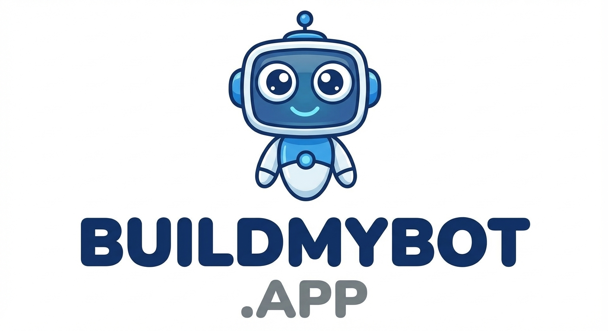

<!-- BRAND_HEADER -->

  
  BuildMyBot.App | Speed-to-Lead Revenue Recovery

# BuildMyBot One-Pager

## What it is
BuildMyBot is a white-label AI platform built on one shared business knowledge base that powers a chatbot, a realtime voice receptionist, and SMS marketing — capturing leads, answering FAQs, and automating follow-up 24/7 across every channel.

## Who it helps
- Local businesses that miss leads after hours
- Teams with slow response time
- Agencies offering AI lead capture to clients

## Top problems we solve
- Missed leads due to delayed responses
- Repetitive questions taking staff time
- Limited lead capture on high traffic pages
- Leads that fall through the cracks between phone, text, and web chat

## Key benefits
- Instant responses for visitors, callers, and text subscribers alike
- One knowledge base trains your chatbot, voice agent, and SMS replies together
- More captured leads from existing traffic
- Simple setup without developers
- Clear analytics and chat logs

## How it works (3 steps)
1) Train once on your website, PDFs, and FAQs
2) Configure branding, lead capture rules, and which channels to turn on
3) Install one script and go live on chat, voice, and SMS

## Optional upgrades
- AI voice receptionist for phone calls — realtime, two-way conversation with barge-in, on a new, forwarded, or ported number
- SMS marketing — two-way campaigns, keyword auto-replies, sequences, Text-to-Win contests, birthday clubs, and appointment reminders, with STOP/HELP consent handling built in
- White-label branding and custom domain
- Advanced analytics and integrations

## Call to action
Start free with a short pilot and review results in 7 to 14 days.
