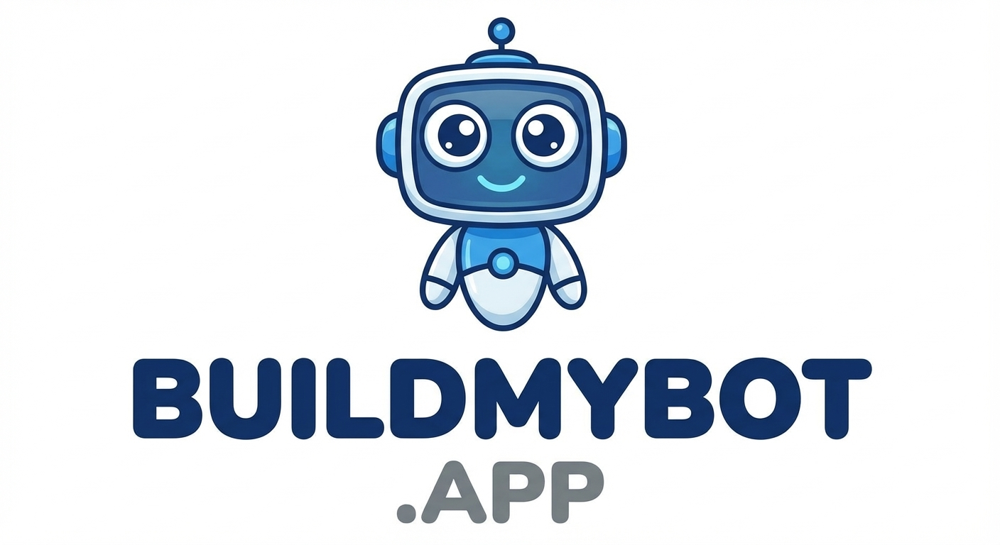

<!-- BRAND_HEADER -->

  
  BuildMyBot.App | Speed-to-Lead Revenue Recovery

# Partner Course

## Purpose
Train partner sales teams to recruit clients, launch pilots, and scale recurring revenue.

## Format
- 8 modules
- Each module includes a goal and practice task

## Module 1: Partner model basics
Goal: Explain the partner model simply.
- You sell and manage the client
- BuildMyBot powers the platform
- You earn recurring commissions
Practice: Write a 30 second partner pitch.

## Module 2: Choose a niche
Goal: Pick one industry to start.
- Easier to build messaging and proof
- Faster referrals
Practice: Pick one niche and list 20 prospects.

## Module 3: Discovery that sells
Goal: Identify lead capture gaps.
Questions:
- How do leads reach you today?
- What happens after hours?
- Which questions slow your team down?
Practice: Record a 5 minute discovery role play.

## Module 4: Demo to pilot
Goal: Move from demo to start free pilot.
- Show one strong use case
- Ask for a short pilot with a clear review date
Practice: Deliver the demo script and close for a pilot.

## Module 5: Packaging and pricing
Goal: Present two to three packages.
- Starter, Growth, Pro
- Price based on outcomes and speed
Practice: Draft pricing for one niche.

## Module 6: Launch checklist
Goal: Go live quickly.
- Collect FAQs and services
- Configure lead capture
- Install and test
Practice: Build a launch checklist in 10 steps.

## Module 7: Retention and expansion
Goal: Keep clients and grow accounts.
- Monthly check-ins
- Quarterly updates
- Add a second bot or voice agent
Practice: Write a 30 day success plan.

## Module 8: Scale with systems
Goal: Build a repeatable process.
- Templates, scripts, and automation
- Weekly pipeline review
Practice: Build your weekly workflow in a calendar.
